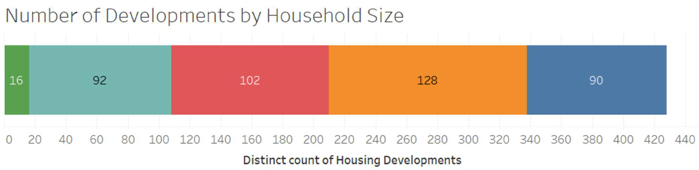

# AFFORDABLE HOUSING DEVELOPMENT
#### Group 4
#### Elio Aybar, Martin Copello, Matthew Fligiel, Matt Norgren

## Table of Content
- [Executive Summary](#executive-summary)
- [Project Objective](##project-objective)
- [Business Use Cases](#business-use-cases)
- [Data](#data)
- [Tools](#tools)
- [Data Cleanup](#data-cleanup)
- [Design Considerations I: Data](design-considerations-i-data)
- [Design Considerations II: Implementation](#design-considerations-ii-implementation)
- [EER Diagram](#eer-diagram)
- [Dimensional Model](#dimensional-model)
- [Preliminary Expectations](#preliminary-expectations)
- [Actual Results](#actual-results)
- [Distance from Housing Developments to One Instance of Public Transportation](#distance-from-housing-developments-to-one-instance-of-public-transportation)
- [Number of Units by Bus and L Distance](#number-of-units-by-bus-and-l-distance)
- [Most units did have access to nearby parks](#most-units-did-have-access-to-nearby-parks)
- [Affordable Housing Developments and Percentage of Neighborhood Below Poverty Line (Centered at 13%)](#affordable-housing-developments-and-percentage-of-neighborhood-below-poverty-line-centered-at-13)
- [Walkscore (Binned by # of Units)](#walkscore-binned-by--of-units)
- [Developments by Per Capita Income](#developments-by-per-capita-income)
- [Abandoned Buildings VS Affordable Housing](#abandoned-buildings-vs-affordable-housing)
- [Conclusion](#conclusion)
- [Areas of Improvement for Project](#areas-of-improvement-for-project)
- [References](#references)

## Executive Summary

Affordable housing developments aid cities in promoting diversity and inclusion, improving quality of life, enriching neighborhoods, and growing the local economy. In this study, we investigate whether the locations of affordable housing developments provide positive features for its population, relating to accessibility to public transportation, amenities, active commercial scene, walkability, and general neighborhood activity.
 
 

Through our investigations, we discovered stark discrepancies between neighborhoods with a multitude of affordable housing developments and those without. Generally, areas with scarce access to transit and worse socio-economic performance contain most affordable housing developments. 
 

## Project Objective
This project seeks to develop an end-to-end data pipeline for affordable housing data to:
- Examine data between the location, price, and size of affordable housing developments and standard-of-life features available for tenants.
- Foster a better understanding of:
    - Factors that affect location, prices, amenities, and quality of affordable housing developments.
- The distribution of socio-economic indicators, economic activity, access to transit and parks, in each neighborhood.
- Potentially identify correlations that may confirm or deny the team’s initial hypotheses related to affordable housing.
  

## Business Use Cases
Understanding affordable housing development’s characteristics’ relationship to socio-economic features could be used to develop more conscious policies and drive significant investments that provide inhabitants of affordable housing a better quality of life (i.e. development of additional public transportation in isolated neighborhoods, investment
in local businesses, etc.)
  

## Data

Data sources included:
- City of Chicago: Affordable Housing Development Dataset, Business Licenses Dataset, Park Dataset, Abandoned Property Datasets
- Zillow and Cook County Records API
- Neighborhood Shapefiles and Boundary files for GIS-type applications including generation of Table Keys (Neighborhoods), Public Transit and City Park GIS data points.
- Web-Scraping Walk-Scores of Chicago neighborhoods 
Data Profile:
- 428 data points, 75 columns, 85.5K rows
  
  

## Tools
- Data was scraped via Python (Walk-Scores), downloaded from online sources (City of Chicago for Housing Developments, Commerce, Park) and gathered using APIs (Google Geocoding,
Zillow, Cook County).
- Pandas was used for data cleanup.
- R was used to build an additional Geocoding API (Google’s) to obtain coordinates from address.
- Our data database was built using MySQL. DDL and DML tables were created for each table.
- Tableau was used to generate tables and charts to draw insights from our data.

### Ingestion and Cleanup
  
  
  
  
  

### Storage
  

### Delivery and Insights
  

## Data Cleanup

### Out-of-scope Geographically
  

### Overwrote Assessed Value with Sale Value (where available)
  

### GIS Conversions
  
  
  

## Design Considerations I: Data
- ETL Scripts written in Python and R
- Keys were generated for tables (neighborhood from latitude and longitude, or from address):
  - Chicago neighborhood shapefiles
  - Geocodes via GeoPy and Google’s Geocoding API via GCP to obtain Latitude and Longitude from address
  - Web-scraping Walk-Scores to calculate “walkability” of area

## Design Considerations II: Implementation

- Number of tables and joins are not extensive, so this pipeline can be implemented locally given enough disk space
- Due to the archival nature of our data, our application can be used as an OLAP system.
- Snowflake data model
- One to many relationship between individual address and neighborhood requires definition of granularity at neighborhood level

## EER Diagram
  

## Dimensional Model
  

## Preliminary Expectations

### Greater number of affordable housing developments.
- In less affluent areas
- Near abandoned buildings
- In highly-commercialized areas

### Fewer number of affordable housing developments
- Near public transit
- Near parks

## Actual Results

### Greater number of affordable housing developments
- In less affluent areas ✔
- Near abandoned buildings ~
- In highly-commercialized areas~

### Fewer number of affordable housing developments
- Near public transit ~
- Near parks X

## Distance from Housing Developments to One Instance of Public Transportation
 
  

## Number of Units by Bus and L Distance
  

## Most units did have access to nearby parks
  

## Affordable Housing Developments and Percentage of Neighborhood Below Poverty Line (Centered at 13%)

 
  

## Walkscore (Binned by # of Units)
 

  

## Developments by Per Capita Income
  

## Abandoned Buildings VS Affordable Housing

### Count of Affordable Housing Developments
### Count of Abandoned Buildings

  
  
  

## Conclusion
Through the course of the project, we discovered strong correlations between the count of affordable housing developments per neighborhood and:
- Socioeconomic status of neighborhood, which could perhaps be explained by higher land costs for more affluent neighborhoods
- Transit scores of neighborhood for L trains, which could perhaps further isolate neighborhoods with lower household income per capita.
Additionally, weaker correlations were identified between the count of affordable housing developments per neighborhood and:
- Business density of each neighborhood
- Count of abandoned buildings of each neighborhood
It is difficult to draw conclusions from these weaker correlations.

## Areas of Improvement for Project
- With enough computing resources and time, further granularity could be utilized to map by-block impacts, driven by the by address level development, assessment, and transportation data, rather than by the neighborhood or area level. This could yield further insight and inform policy by visualizing ripple effects related to affordable
housing developments and the blocks in which they are built.
- Obtaining data from the 2020 U.S. Census and re-evaluate our findings
- Study additional datasets (type of housing, family size, health background, etc.)

## References
- City of Chicago Data Portal: https://data.cityofchicago.org/
- Institute for Housing Studies at DePaul University: https://www.housingstudies.org/
- Google Maps Platform: https://developers.google.com/maps/documentation
- Python for Data Analysis: Data Wrangling with Pandas, NumPy, and IPython 1st Edition by Wes McKinney